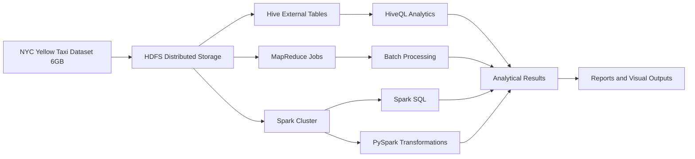

# 🚕 NYC Yellow Taxi Big Data Analysis

## 🌟 Project Overview
This project focuses on analyzing the **NYC Yellow Taxi Trip Dataset (~6 GB)** using **Big Data technologies** to extract meaningful insights from large-scale data. The objective is to demonstrate how distributed systems can efficiently process, query, and analyze massive datasets that are not feasible to handle on a single machine.

The project was completed as a **team-based Big Data coursework assignment**, where we designed and executed queries on a **custom local cluster formed by combining three laptops**, simulating a real-world distributed environment.

---

## 🎯 Why This Project Matters
Real-world data is often:
- Large in size
- Distributed across systems
- Too slow to process using traditional tools

This project demonstrates:
- How big data tools solve scalability problems
- How distributed computing improves performance
- How analytical insights can be derived from massive datasets

---

## 📊 Dataset Description

### 📁 Dataset Used
**NYC Yellow Taxi Trip Data**  
Source: Kaggle  
https://www.kaggle.com/datasets/elemento/nyc-yellow-taxi-trip-data

### 📦 Dataset Details
- Size: ~6 GB
- Type: Structured, real-world transportation data
- Each row represents a single taxi trip in New York City

### 📌 Key Features
- Pickup and dropoff timestamps
- Pickup and dropoff locations
- Trip distance
- Passenger count
- Fare amount and payment type

This dataset is large enough to require **distributed storage and parallel processing**, making it ideal for Big Data analysis.

---

## 🛠️ Tools & Technologies Used

| Tool | Purpose |
|-----|--------|
| **Hadoop / HDFS** | Distributed storage of large datasets |
| **Hive** | Data warehousing and batch analytics |
| **HiveQL** | SQL-like querying on large datasets |
| **MapReduce** | Parallel batch data processing |
| **PySpark** | Distributed data transformations |
| **Spark SQL** | Fast, in-memory SQL analytics |
| **Local Multi-node Cluster** | Distributed execution using 3 laptops |

---

## 📂 Project Structure

```text
NYC-taxi-dataset-analysis/
│
├── data/                          # Raw NYC Yellow Taxi dataset
│
├── queries/                       # Big Data queries
│   ├── hive_queries.hql           # HiveQL queries
│   ├── spark_sql_queries.sql      # Spark SQL queries
│   └── bigdata_queries.txt        # Combined analytical queries
│
├── scripts/                       # Processing scripts
│   └── pyspark_analysis.py        # PySpark transformations
│
├── results/                       # Output screenshots & results
│
├── report/                        # Detailed project report
│   ├── NYC_Taxi_Report.pdf
│   └── NYC_Taxi_Report.docx
│
├── presentation/                  # Coursework presentation
│   ├── NYC_Taxi_Presentation.pdf
│   └── NYC_Taxi_Presentation.pptx
│
└── README.md
```

## 🏗️ Big Data Architecture Diagram



## 🧠 Methodology

### 🔹 Step 1: Cluster & Environment Setup
To handle the large dataset efficiently:
- A local Hadoop cluster was created by connecting **three laptops**
- Each system acted as a **node** in the cluster
- **Hadoop Distributed File System (HDFS)** was used to store data across nodes  

This setup simulated a real-world **distributed computing environment**.

---

### 🔹 Step 2: Data Ingestion into HDFS
- The NYC Yellow Taxi dataset was uploaded into **HDFS**
- Data was distributed across multiple nodes
- This enabled **parallel processing** and **fault tolerance**

Storing data in HDFS ensured scalability and efficient access by **Hive** and **Spark**.

---

### 🔹 Step 3: Schema Definition & Hive Tables
- External **Hive tables** were created on top of HDFS data
- Proper schemas were defined to match dataset columns
- **HiveQL** enabled SQL-style analytics on large datasets  

This step made the data easy to query using familiar SQL syntax.

---

### 🔹 Step 4: Batch Processing using Hive & MapReduce
Using **HiveQL** and **MapReduce** jobs, batch queries were executed to:
- Identify peak pickup hours
- Find busiest pickup and dropoff locations
- Calculate average trip distance and fare
- Analyze payment method usage  

MapReduce handled large-scale aggregation and filtering efficiently.

---

### 🔹 Step 5: Distributed Analytics using Spark & PySpark
To improve performance:
- **Spark SQL** was used for fast, in-memory queries
- **PySpark** was used for distributed data transformations and aggregations  

Spark significantly reduced execution time compared to traditional MapReduce, especially for iterative queries.

---

### 🔹 Step 6: Result Collection & Analysis
- Query outputs were stored in **HDFS**
- Results were exported and documented
- Screenshots and outputs were included in the `results/` directory
- Findings were summarized in the project report and presentation

---

## 📊 Analytical Questions Answered
- What times of day have the highest taxi demand?
- Which pickup and dropoff locations are most popular?
- How does trip distance affect fare amount?
- Which payment methods are most commonly used?
- What are the busiest travel patterns in NYC?

---

## 🤝 Team Contribution
This was a **team-based project**, with collaborative contributions including:
- Setting up the local distributed cluster
- Uploading and managing data in HDFS
- Writing HiveQL, Spark SQL, and PySpark queries
- Analyzing results and preparing reports and presentations

---

## 🧩 Skills Demonstrated
- Big Data processing using the Hadoop ecosystem
- Distributed storage and computing
- HiveQL and Spark SQL analytics
- PySpark transformations
- Multi-node cluster configuration
- Query optimization on large datasets

---

## 🚀 How to Reproduce the Project
1. Install Hadoop, Hive, and Spark
2. Configure a multi-node Hadoop cluster
3. Upload the dataset into HDFS
4. Create Hive tables using HiveQL
5. Execute MapReduce, Hive, and Spark queries
6. Analyze and document results

---

## ⭐ Final Note
This project showcases practical experience in handling real-world large-scale datasets using distributed systems and Big Data technologies. It demonstrates how scalable architectures and parallel processing can be used to extract valuable insights efficiently.


